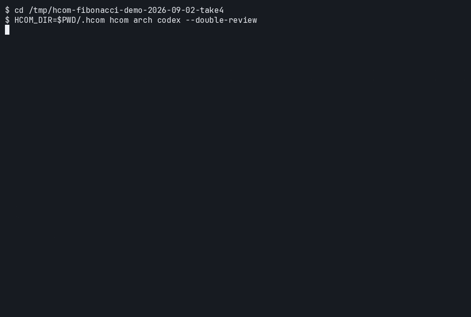
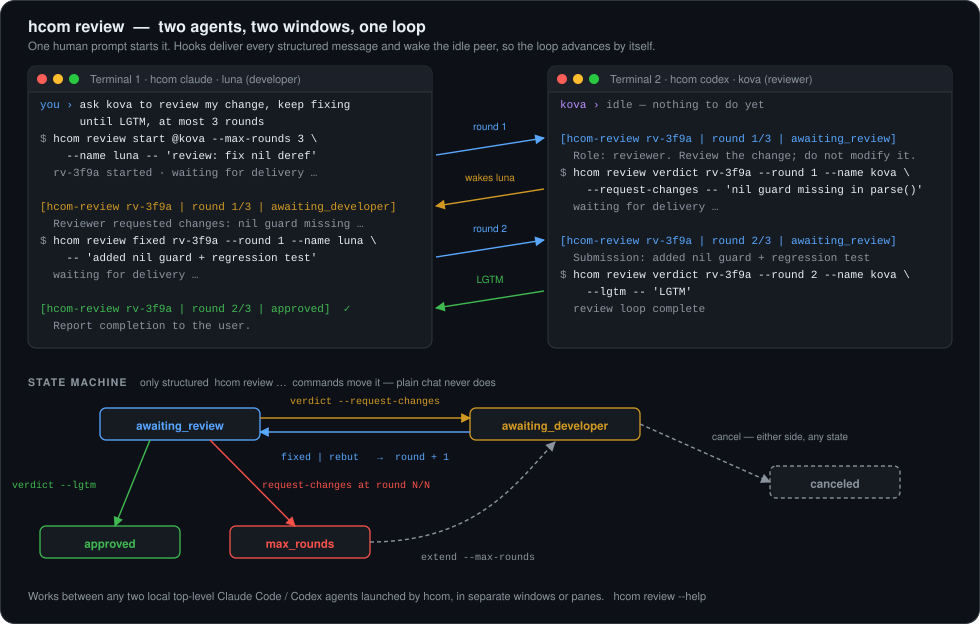
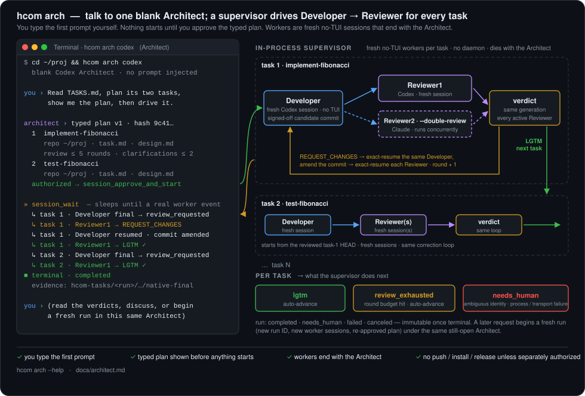

# hcom

[](https://github.com/cfzjywxk/hcom/actions/workflows/ci.yml)
[](https://github.com/cfzjywxk/hcom/blob/master/LICENSE)

> **Hook your coding agents together — then let them review, fix, and re-review each other while you watch.**

Built on [aannoo/hcom](https://github.com/aannoo/hcom): one Rust binary, no
daemon, that lets Claude Code, Codex, Gemini, Cursor, Copilot and friends
**message**, **watch**, and **spawn** each other across terminals.

This fork adds two things upstream doesn't have: a **review loop that runs
itself across windows**, and an **Architect** that plans with you in one
window and drives Developer → Reviewer workers in the background.



<sup>Real run, unedited output, ~11 minutes played back in 85 seconds: one prompt, one approval, two tasks developed in the background and independently reviewed by Codex and Claude, both LGTM.</sup>

---

## The review loop runs itself



One prompt. Two windows. Structured `hcom review` messages bounce between
developer and reviewer, waking whichever side is idle, until LGTM or the round
cap. Chat can't move the state, only the commands can, so the loop is
deterministic and you can walk away.

> ask codex to review my change, keep fixing and re-reviewing until LGTM, at most 3 rounds

---

## The Architect drives the work; you keep the wheel



`hcom arch codex` opens a *blank* Architect. You type the first prompt, talk
it through, and get a typed plan back. Say "drive it" and an in-process
supervisor runs a fresh Developer and Reviewer per task, resuming the exact
same sessions for corrections and moving on at LGTM. Every verdict is a file
you can read. Nothing is pushed or installed unless you say so. Close the
window and it all stops.

> Read TASKS.md, plan its tasks in order, show me the plan, then drive it.

`--double-review` adds a second, concurrent Reviewer from the other provider.
`--github-pr` delivers the result as a Pull Request instead of a local commit.
`hcom arch claude` swaps the Architect.

---

## Try it

```bash
git clone https://github.com/cfzjywxk/hcom.git && cd hcom
cargo build --release --locked                                   # Rust 1.88+
install -m 0755 target/release/hcom target/release/hcom-architect-mcp ~/.local/bin/

hcom claude        # window 1
hcom codex         # window 2 — now ask either one for a review loop
hcom arch codex    # or hand the Architect a task list
```

The fork does not track upstream releases; `hcom update` is disabled on
purpose. Model defaults, per-role profiles, and the Claude proxy gate are in
the [Architect guide](docs/architect.md).

---

## Learn more

- [Architect guide](docs/architect.md) · [GitHub PR lane](docs/github-pr-lane.md) · [Claude task-lane testing](docs/claude-task-lane-testing.md)
- [Codex adapter contract](docs/codex-adapter-contract.md) · [Codex exec worker lane](docs/codex-exec-worker-lane.md)

Issues and PRs welcome. The codebase is Rust; `just ci` runs the CI gate locally. [MIT](LICENSE).
